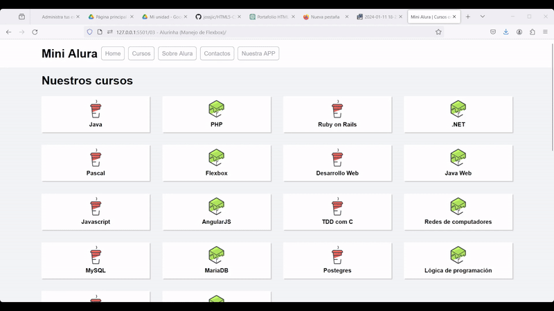
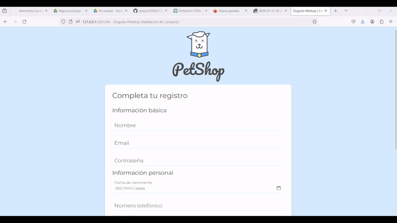
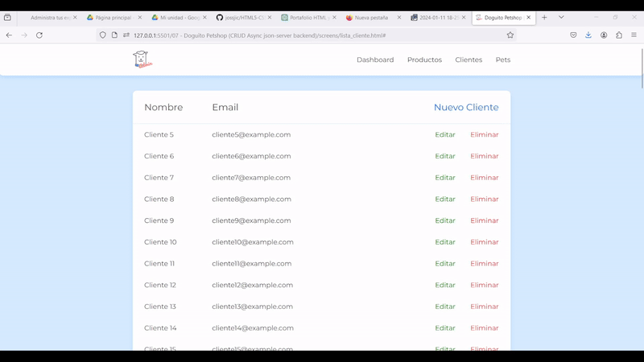

# HTML 🌐 and CSS 🎨 Portfolio - **José Juan Irene Cervantes**

[Haz click aquí para ver la versión en español de la documentación](README_ES.md)

Greetings, curious recruiters and code enthusiasts! Welcome to my HTML and CSS repository, where creativity and technical skills come together to form an exceptional portfolio of web projects built with these technologies.

## Repository Description

This repository hosts a series of projects focused on HTML5 and CSS3, demonstrating skills ranging from responsive design to managing flexbox, databases, and field validation. Each project represents a milestone on the path to learning and mastering a web development skill.

## Main Project
> [!NOTE]  
> ### 00 - Engineering Expo (My most extensive project with HTML5, CSS3 and PHP)
> 
> - Description: Over a period of 6 months, we worked on a web page (Frontend and Backend) for the project management of the Monterrey Institute of Technology.
> - Technologies: We used PHP and MySQL for managing and interacting with the database, and HTML5, CSS3, JavaScript, and SCSS for presenting the information.
> ### Links
> - [Repository (You also have access from the submodule)](https://github.com/jossjic/ExpoIngenieria)
> - [Page demonstration](https://jossjic.github.io/ExpoIngenieria/)
> ### Test Accounts
> - Administrator
>     - Email: `adm@expo.mx`
>     - Password: `1234`
> - Collaborator
>     - Email: `luisa@example.com`
>     - Password: `clave123`
> - Project
>     - Key Name: `proyecto1`
>     - Password: `123456`

## Highlighted Projects
### 01 - 📈 MarkLive (My First Project)

- Description: One of the first HTML projects I did, where I started to understand the concepts of web programming. The page is focused on managing marketing campaigns.
- Technologies: Mainly HTML5 and CSS3, at a basic level.
- Usage:
    - Download the folder in zip (recommended) or clone the repository
    - Unzip the folder if you downloaded it
    - Run the index.html file (for best results, do it on a local or remote web server)

  
### 02 - 🧔‍♂️ Alura Barbershop (HTML5 and Basic CSS3)

- Description: The first project carried out in the Oracle Next Education program, focused on the use of external resources and best practices. The page is focused on a barbershop.
- Technologies: HTML and CSS
- Usage:
    - Download the folder in zip (recommended) or clone the repository
    - Unzip the folder if you downloaded it
    - Run the index.html file (for best results, do it on a local or remote web server)

### 03 - 🤖 Alurinha (Flexbox Management)

- Description: Project focused on the Flexbox design model, a shorter project that seeks to exploit this technology.
- Technologies: HTML and CSS, with a focus on Flexbox.
- Usage:
    - Download the folder in zip (recommended) or clone the repository
    - Unzip the folder if you downloaded it
    - Run the index.html file (for best results, do it on a local or remote web server)
  
### 04 - 📱 Apeperia (Responsive Design)

- Description: Project focused on Mobile First and responsive design. The page is focused on a company in the mobile device industry.
- Technologies: HTML and CSS, with a responsive focus.
- Usage:
    - Download the folder in zip (recommended) or clone the repository
    - Unzip the folder if you downloaded it
    - Run the index.html file (for best results, do it on a local or remote web server)

### 05 - 🍉 Fruta & Fruto (CSS Atomic Design)

- Description: Project focused on Brad Frost's Atomic Design methodology. Simple design focused on structuring from this methodology. The page is focused on cooking recipes.
- Technologies: HTML and CSS, with an Atomic Design focus.
- Usage:
    - Download the folder in zip (recommended) or clone the repository
    - Unzip the folder if you downloaded it
    - Run the index.html file (for best results, do it on a local or remote web server)

### 06 - 🐕 Doguito Petshop (Field Validation)

- Description: Small page with the purpose of practicing field validation with regular expressions and native technologies. The page is focused on a pet shop.
- Technologies: HTML and CSS, with a focus on regular expressions and field validation.
- Usage:
    - Download the folder in zip (recommended) or clone the repository
    - Unzip the folder if you downloaded it
    - Run the index.html file (for best results, do it on a local or remote web server)

### 07 - 🐕 Doguito Petshop (CRUD Async json-server backend)

- Description: Small page with the purpose of practicing CRUD data management in Javascript ([Link to the Javascript repository](https://github.com/jossjic/JavaScript)) and the use of databases.
- Technologies: HTML, CSS, and JS, with a focus on data management.
- Usage:
    - Download the folder in zip (recommended) or clone the repository
    - Unzip the folder if you downloaded it
    - Run the lista_cliente.html file (it is 100% necessary to do it on a web server due to http protocol rules)
    - Raise a backend server with the db.json file, I used npm's json-server for this, following these commands in the root folder terminal:
 ~~~
npm install json-server
Set-ExecutionPolicy Unrestricted (you need to run the terminal with administrator permissions to do this)
json-server .\db.json
~~~
And done, that's how I temporarily mounted the page's backend server

>[!IMPORTANT]
> ## Contributions and Contact
> - I'm open to collaborations and suggestions! Feel free to explore, fork, and contribute to this repository.
> - For any questions or comments, please do not hesitate to get in touch at:
> - [LinkedIn](https://www.linkedin.com/in/jossjic/)
> - [Email](mailto:jossjic_03@hotmail.com)
> - **Thank you for visiting and exploring my HTML and CSS project portfolio!**
